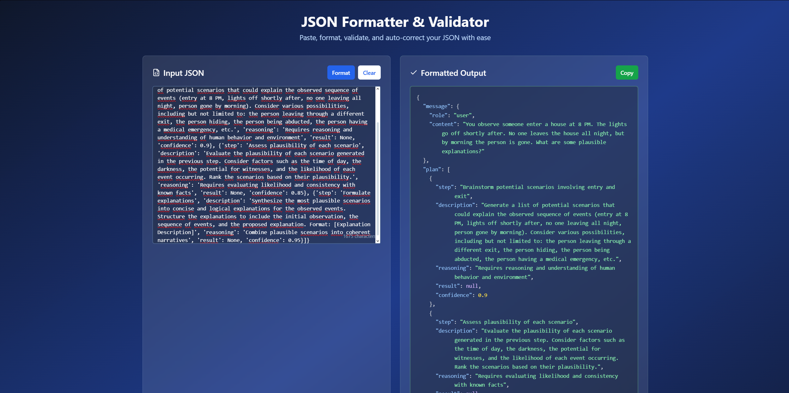

# JSON Scribe Correct

A modern, user-friendly web app for formatting, validating, and auto-correcting JSON. Built with React, Vite, TypeScript, Tailwind CSS, and shadcn/ui components.

## Features

- **Paste, format, and validate JSON** in real time
- **Auto-corrects common JSON mistakes** (unquoted keys, single quotes, trailing commas, etc.)
- **Helpful error messages** and suggestions
- **Copy formatted JSON** to clipboard
- **Beautiful, responsive UI** with dark mode support
- **No backend required** – runs entirely in the browser

## Demo

 <!-- Replace with actual screenshot if available -->

## Getting Started

### Prerequisites

- [Node.js](https://nodejs.org/) (v18+ recommended)
- [pnpm](https://pnpm.io/) or [npm](https://www.npmjs.com/) or [yarn](https://yarnpkg.com/)

### Installation

```sh
# Clone the repository
git clone https://github.com/LordOfMim/json-scribe-correct.git
cd json-scribe-correct

# Install dependencies
pnpm install
# or
npm install
# or
yarn install
```

### Running Locally

```sh
pnpm dev
# or
npm run dev
# or
yarn dev
```

Open [http://localhost:8080](http://localhost:8080) in your browser.

### Building for Production

```sh
pnpm build
# or
npm run build
# or
yarn build
```

### Preview Production Build

```sh
pnpm preview
# or
npm run preview
# or
yarn preview
```

## Project Structure

- `src/pages/Index.tsx` – Main page with JSON formatter UI
- `src/components/JSONFormatter.tsx` – Core logic for formatting, validating, and auto-correcting JSON
- `src/components/JSONInput.tsx` – Input textarea for JSON
- `src/components/JSONOutput.tsx` – Formatted JSON output with syntax highlighting
- `src/components/ErrorDisplay.tsx` – Error and validation messages
- `src/components/ui/` – UI components from shadcn/ui
- `public/` – Static assets

## Tech Stack

- [React](https://react.dev/) + [TypeScript](https://www.typescriptlang.org/)
- [Vite](https://vitejs.dev/) – Fast build tool
- [Tailwind CSS](https://tailwindcss.com/) – Utility-first CSS
- [shadcn/ui](https://ui.shadcn.com/) – Accessible, customizable UI components
- [Radix UI](https://www.radix-ui.com/) – Primitives for React UI
- [Lucide Icons](https://lucide.dev/) – Icon set
- [@tanstack/react-query](https://tanstack.com/query/latest) – Data fetching and caching

## Customization

- **Styling:** Tailwind config in `tailwind.config.ts`
- **Component overrides:** All UI components are in `src/components/ui/`
- **Auto-correction logic:** See `src/components/JSONFormatter.tsx`

## License

MIT
